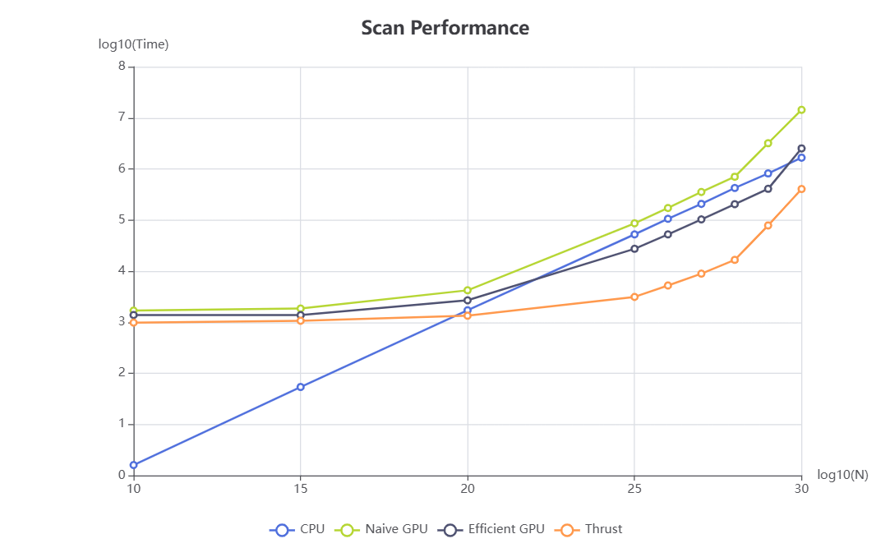
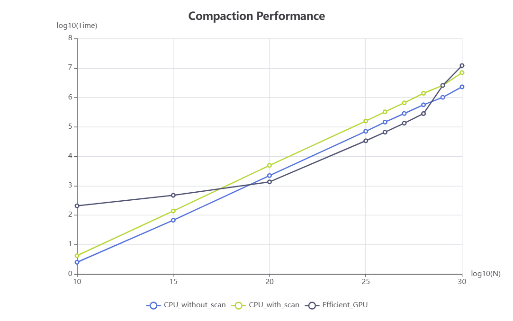

CUDA Stream Compaction
======================

**University of Pennsylvania, CIS 565: GPU Programming and Architecture, Project 2**

* Hongyi Ding
  * [LinkedIn](https://www.linkedin.com/in/hongyi-ding/), [personal website](https://johnnyding.com/)
* Tested on: Windows 11, i7-12700 @ 2.10GHz 32GB, NVIDIA T1000 4GB (SEAS Virtual Lab)

### Description

In this project, we implemented scan & stream compaction algorithms in different ways. We intend to compare the performance of different implementations, including cpu scan & compation, naive gpu scan, and scanning using the thrust library.

### Performance Analysis

This table shows the time needed for scanning over the number of numbers using different ways. The time is recorded in ms.

| N    | CPU     | Naive GPU | Efficient GPU | thrust   |
| ---- | ------- | --------- | ------------- | -------- |
| 2^10 | 0.0016  | 1.68691   | 1.38016       | 0.981888 |
| 2^15 | 0.054   | 1.84899   | 1.37459       | 1.06662  |
| 2^20 | 1.7093  | 4.20902   | 2.68237       | 1.34141  |
| 2^25 | 52.4132 | 86.1861   | 27.3095       | 3.1232   |
| 2^26 | 105.806 | 171.778   | 52.3393       | 5.23088  |
| 2^27 | 206.849 | 353.931   | 102.907       | 8.9111   |
| 2^28 | 424.237 | 703.445   | 204.032       | 16.5718  |
| 2^29 | 816.657 | 3192.93   | 407.458       | 78.364   |
| 2^30 | 1662.63 | 14334     | 2523.06       | 404.013  |

This table shows the time needed for compaction over the number of numbers using different ways. The time is recorded in ms.

| N    | CPU without scan | CPU with scan | Efficient GPU |
| ---- | ---------------- | ------------- | ------------- |
| 2^10 | 0.0025           | 0.0042        | 0.206528      |
| 2^15 | 0.067            | 0.1381        | 0.471424      |
| 2^20 | 2.2095           | 4.8973        | 1.34582       |
| 2^25 | 70.2928          | 156.767       | 33.5974       |
| 2^26 | 143.941          | 323.207       | 65.5928       |
| 2^27 | 282.771          | 652.236       | 132.566       |
| 2^28 | 558.38           | 1376.53       | 281.205       |
| 2^29 | 1003.12          | 2541.53       | 2543.02       |
| 2^30 | 2273.97          | 6898.14       | 11972.5       |

### Answer to Questions

* Roughly optimize the block sizes of each of your implementations for minimal
  run time on your GPU.

  * This is the table of performance of efficient GPU scan over different block sizes

    | Block Size  | 128     | 256     | 512    | 768     | 1024    |
    | ----------- | ------- | ------- | ------ | ------- | ------- |
    | Performance | 53.6786 | 52.3393 | 52.817 | 52.2205 | 52.7176 |

    The difference is minor for different block sizes. So we just take the common block size of 256.

* Compare all of these GPU Scan implementations (Naive, Work-Efficient, and
  Thrust) to the serial CPU version of Scan. Plot a graph of the comparison
  (with array size on the independent axis).

  * 
  * 

* Write a brief explanation of the phenomena you see here.

  * Can you find the performance bottlenecks? Is it memory I/O? Computation? Is
    it different for each implementation?
    * When N is small (`<2^20`), for all 3 GPU implementations, the overhead of initializing memory and transferring data is high. As we can observe in the graph, when `N<2^20`, cpu version has a better performance. So in this situation, the bottleneck is initializing and Host-Device communication.
    * When N becomes larger (`2^20` to `2^28`), the gpu implementations are much better. The parallelism is making the the algorithm perform better than the single-thread version on gpu.
    * When N grows very large (`>2^28`), due to limited GPU memory (which is only 4GB on the test machine), the program has to use shared memory, then the memory I/O has a much larger latency. So in this case, all 3 gpu implementations begin to perform worse and worse, even worse than the cpu version.

* Paste the output of the test program into a triple-backtick block in your
  README.

  * this is the output when `N=1<<26`

    ```
    ****************
    ** SCAN TESTS **
    ****************
        [   0   9  47  18  42  18  43  43  37  33   6  43  41 ...  15   0 ]
    ==== cpu scan, power-of-two ====
       elapsed time: 105.806ms    (std::chrono Measured)
        [   0   0   9  56  74 116 134 177 220 257 290 296 339 ... 1643626790 1643626805 ]
    ==== cpu scan, non-power-of-two ====
       elapsed time: 106.817ms    (std::chrono Measured)
        [   0   0   9  56  74 116 134 177 220 257 290 296 339 ... 1643626693 1643626732 ]
        passed
    ==== naive scan, power-of-two ====
       elapsed time: 171.778ms    (CUDA Measured)
        passed
    ==== naive scan, non-power-of-two ====
       elapsed time: 160.932ms    (CUDA Measured)
        passed
    ==== work-efficient scan, power-of-two ====
       elapsed time: 52.3393ms    (CUDA Measured)
        passed
    ==== work-efficient scan, non-power-of-two ====
       elapsed time: 50.5345ms    (CUDA Measured)
        passed
    ==== thrust scan, power-of-two ====
       elapsed time: 5.23088ms    (CUDA Measured)
        passed
    ==== thrust scan, non-power-of-two ====
       elapsed time: 4.78698ms    (CUDA Measured)
        passed
    
    *****************************
    ** STREAM COMPACTION TESTS **
    *****************************
        [   2   0   0   1   1   1   2   2   0   1   2   1   2 ...   0   0 ]
    ==== cpu compact without scan, power-of-two ====
       elapsed time: 143.941ms    (std::chrono Measured)
        [   2   1   1   1   2   2   1   2   1   2   1   1   1 ...   3   1 ]
        passed
    ==== cpu compact without scan, non-power-of-two ====
       elapsed time: 139.827ms    (std::chrono Measured)
        [   2   1   1   1   2   2   1   2   1   2   1   1   1 ...   3   1 ]
        passed
    ==== cpu compact with scan ====
       elapsed time: 323.207ms    (std::chrono Measured)
        [   2   1   1   1   2   2   1   2   1   2   1   1   1 ...   3   1 ]
        passed
    ==== work-efficient compact, power-of-two ====
       elapsed time: 65.5928ms    (CUDA Measured)
        passed
    ==== work-efficient compact, non-power-of-two ====
       elapsed time: 65.4395ms    (CUDA Measured)
        passed
    ```

    